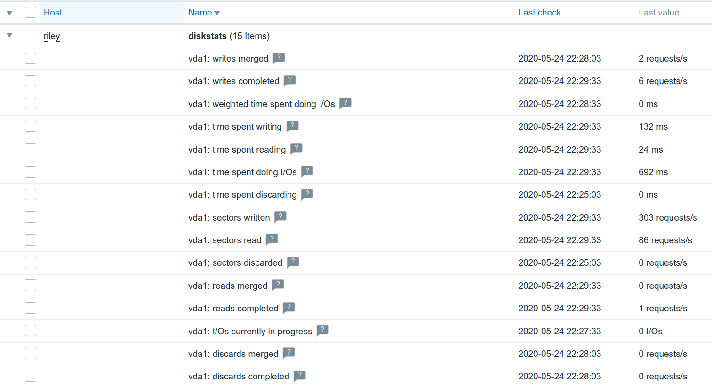
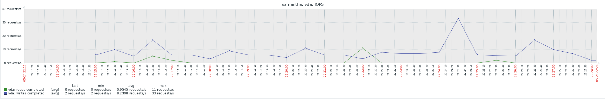

# Zabbix Template: OS Linux diskstats

Monitoring template for Zabbix to get Linux disk statistics.

## About

This is a self-contained monitoring template for Zabbix to get I/O statistics from Linux systems. The information will be taken from /proc/diskstats.

## Examples

### Items

### Graph

## Links

* [/proc/diskstats](https://www.kernel.org/doc/Documentation/ABI/testing/procfs-diskstats)
* [I/O statistics fields](https://www.kernel.org/doc/Documentation/admin-guide/iostats.rst)

## Known Issues

* If the file /proc/diskstats is larger than 64KB, then this template won't work anymore because of the limit of [vfs.file.contents](https://www.zabbix.com/documentation/current/manual/config/items/itemtypes/zabbix_agent).
